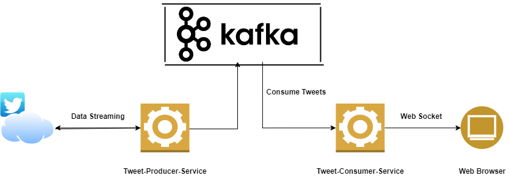
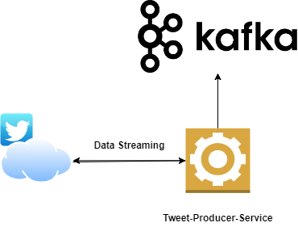

# **This application developed in Spring-boot 2.6.x framework, using Java 11 version**

###### **Application Functionality**

This application is producing tweets to Kafka cluster. It is using Twitter Streaming
API to get tweets as soon as they are available based on the filter provided.

First way to get tweets is using twitter4J library which connects to v1.1 version, but due to limit on per day tweet stream,
its decided not use that and use latest version FIltered Stream API.
We are using filtered stream API V2 of Twitter, more documentation available here ::

###### Complete Project Architecture

###### Project Scope

###### **Prerequisite**

To run this application make sure you have connectivity with Kafka broker server.
Currently master branch is connecting to localhost that means kafka broker server should be up and running locally.

Another branch `karan/CloudSetup` is in progress to connect with Kafka brokers running on cloud.
 
Command to run project locally::
mvn spring-boot:run

